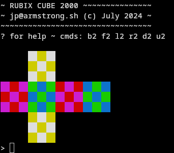

# Rubix Cube 1000

Rubik's cube simulator written in C. 

To build:

```
make
```

To run:

```
./rubix
```

To play:

```
USAGE: 
q        quit
?        help
!        debug mode
c        reset cube
s        scramble cube
turn cube clockwise (counter-clockwise):
u (u')   turn up face
l (l')   turn left face
r (r')   turn right face
f (f')   turn front face
b (b')   turn back face
d (d')   turn down face
```

## Screenshot


